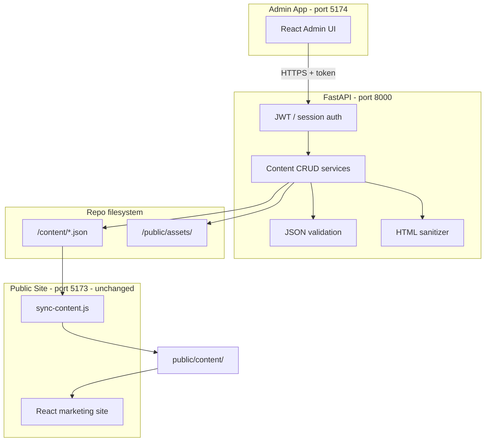

# Project 2 — Eagle Logistics Admin CMS

**Status:** Planning  
**Branch:** `project-2` (all P2 work happens here; `main` stays frozen at `v1.0.0-p1`)  
**Depends on:** [PROJECT1.md](PROJECT1.md) — static public site complete  
**Repository:** [eagle_logistics_new](https://github.com/Husky1711/eagle_logistics_new)

---

## 1. Goal

Build an **admin panel + API** so non-developers can edit site content without touching code. The public marketing site (Project 1) **does not get rewritten** — it keeps reading the same JSON shape; only **how content is written** changes.

| Today (P1) | After P2 |
|------------|----------|
| Edit `/content/*.json` in IDE | Edit via admin UI |
| `npm run sync:content` | API saves JSON + optional auto-sync |
| Manual commit/push | Save → validate → sync (dev); production publish TBD |

### 1.1 Publish model

| Environment | What “publish” means |
|-------------|----------------------|
| **Local dev (Sprint 1)** | API writes `/content/*.json` → runs `sync:content` → refresh public site at `:5173` |
| **Codespaces** | Same as local dev |
| **Production (later)** | Separate deploy sprint: rebuild `dist/`, GitHub Pages, optional git commit — **not in Sprint 1** |

Sprint 1 does **not** auto-commit to git. Editors see changes after sync + browser refresh.

---

## 2. Actual requirements (Project 2 scope)

### In scope

| Requirement | Description |
|-------------|-------------|
| **Admin UI** | Separate React app for content management |
| **REST API** | FastAPI backend to read/write content files |
| **Authentication** | Protected admin routes (single admin user for MVP) |
| **Settings CRUD** | Edit `settings.json` (site, header, footer, contact) |
| **Offers CRUD** | Edit `offers.json` (title, dates, code, CTA, active) |
| **Couriers CRUD** | Edit `couriers.json` (Sprint 2) |
| **Pricing rules CRUD** | Edit `pricing-rules.json` (Sprint 2) |
| **Page content CRUD** | Edit `pages/*.json` (Sprint 3) |
| **JSON validation** | Validate shape on save (Sprint 1–2) |
| **Map embed sanitization** | Strip unsafe HTML on contact map save (Sprint 3) |
| **Media upload** | Upload to `public/assets/` (Sprint 3) |
| **CI workflow** | Test API + public `npm run verify` on PR (Sprint 2+) |

### Out of scope (for now)

| Item | Notes |
|------|-------|
| Multi-user roles | Single admin MVP; roles later |
| Public site feature changes | Bug fixes only on `main` |
| Mobile app | Future phase |
| Live API for public site | Sprint 1 writes files; optional API read later |
| GitHub Pages deploy | Separate deploy sprint |

---

## 3. Architecture

### High-level diagram



### Principles (from P1 senior review)

1. **Separate apps** — public site and admin are different Vite apps in the same repo.
2. **Same content contract** — admin writes the exact JSON files P1 already reads.
3. **Pure utils unchanged** — `pricingCalculator.js`, `dates.js` stay the behavior source of truth on the public site.
4. **Pages should not change** — at most, `useContent` fetch URL becomes configurable later.
5. **`main` is frozen** — P1 releases from `main`; P2 merges when ready.

---

## 4. Repository layout (target)

```
eagle_logistics_new/
├── content/                    # source of truth (API writes here)
├── public/                     # assets + generated content
├── src/                        # PUBLIC site (Project 1) — minimal changes
├── admin/                      # NEW — Admin React app
│   ├── src/
│   │   ├── pages/              # Login, Dashboard, Settings, Offers, …
│   │   ├── components/
│   │   ├── api/                # API client
│   │   └── App.jsx
│   ├── package.json            # or shared root with workspaces
│   └── vite.config.js
├── backend/                    # NEW — FastAPI
│   ├── app/
│   │   ├── main.py
│   │   ├── auth.py
│   │   ├── routers/
│   │   │   ├── settings.py
│   │   │   ├── offers.py
│   │   │   ├── couriers.py
│   │   │   ├── pricing.py
│   │   │   └── pages.py
│   │   ├── services/           # read/write JSON files
│   │   ├── schemas/            # Pydantic models
│   │   └── validators/
│   ├── requirements.txt
│   └── tests/
├── scripts/                    # existing + optional publish script
├── .github/workflows/          # NEW — CI
├── PROJECT1.md
├── PROJECT2.md                 # this document
└── package.json                # npm workspaces (`admin` app)
```

### 4.1 Atomic content writes

On every `PUT`, the API:

1. Copies current file to `content/.backups/{name}.{timestamp}.json`
2. Writes to `{name}.json.tmp`
3. Renames tmp → final (atomic replace)
4. Runs `node scripts/sync-content.js`

Implemented in `backend/app/services/content_store.py`.

---

## 5. Tech stack

| Layer | Choice | Why |
|-------|--------|-----|
| API | **FastAPI** (Python 3.11+) | Matches prior reference repo; fast CRUD; Pydantic validation |
| Auth | **httpOnly session cookie** (Starlette `SessionMiddleware`) | Single admin; XSS-resistant vs localStorage JWT |
| Admin UI | **React 18 + Vite + Tailwind** | Team already knows stack; reuse orange/gold tokens |
| Validation | **Pydantic v2** | Request/response + JSON file shape |
| Map sanitize | **bleach** or allowlist iframe attrs | TD-5 from P1 |
| Tests | **pytest** (API, from Sprint 1) + Vitest/Playwright (public) | |
| Dev env | Extend `.devcontainer` | Run public + admin + API together |

---

## 6. API design (draft)

Base URL: `http://localhost:8000/api`

### Auth

| Method | Path | Description |
|--------|------|-------------|
| `POST` | `/auth/login` | `{ username, password }` → token |
| `POST` | `/auth/logout` | Invalidate session (if cookie-based) |
| `GET` | `/auth/me` | Current user (admin) |

### Content (protected)

| Method | Path | File | Sprint |
|--------|------|------|--------|
| `GET` | `/admin/settings` | `settings.json` | 1 |
| `PUT` | `/admin/settings` | `settings.json` | 1 |
| `GET` | `/admin/offers` | `offers.json` | 1 |
| `PUT` | `/admin/offers` | `offers.json` | 1 |
| `GET` | `/admin/couriers` | `couriers.json` | 2 |
| `PUT` | `/admin/couriers` | `couriers.json` | 2 |
| `GET` | `/admin/pricing-rules` | `pricing-rules.json` | 2 |
| `PUT` | `/admin/pricing-rules` | `pricing-rules.json` | 2 |
| `GET` | `/admin/pages` | list `pages/*.json` | 3 |
| `GET` | `/admin/pages/{slug}` | e.g. `home` | 3 |
| `PUT` | `/admin/pages/{slug}` | | 3 |
| `POST` | `/admin/media` | upload to `public/assets/` | 3 |

### Public (optional — later)

| Method | Path | Description |
|--------|------|-------------|
| `GET` | `/public/content/{path}` | Serve JSON (alternative to static files) |

**Sprint 1 publish flow:** `PUT` → write `/content/` → run `sync:content` (script or subprocess) → public site sees changes after refresh/rebuild.

---

## 7. Admin UI screens (draft)

### Sprint 1

| Screen | Edits |
|--------|-------|
| **Login** | Username/password |
| **Dashboard** | Links to sections; last saved timestamp |
| **Site settings** | Site name, tagline, description |
| **Header / Footer** | Menu items, quick links, footer description |
| **Contact** | Address, phone, WhatsApp, email, hours, Maps URL (**not embed textarea**) |
| **Offers** | Active toggle, title, subtitle, code, start/end dates, CTA |

> **Sprint 1 security:** `googleMapsEmbed` is **preserved** on settings save (not editable in admin until Sprint 3 sanitizer).

### Sprint 2a — Couriers

| Screen | Edits |
|--------|-------|
| **Couriers** | List, add/edit, logo filename, tracking URL, active, order |

### Sprint 2b — Pricing rules

| Screen | Edits |
|--------|-------|
| **Pricing rules** | Validated JSON editor (nested zones) |

### Sprint 3

| Screen | Edits |
|--------|-------|
| **Pages** | Pick page → edit hero, sections, meta (JSON editor or forms) |
| **Media library** | Upload images, copy path for JSON |
| **Map embed** | Textarea with preview + sanitization warning |

---

## 8. Sprint plan

### Sprint 1 — Settings + Offers (MVP admin) ✅ scaffolded

**Goal:** Edit contact info and promotional offer without touching IDE.

| Task | Status |
|------|--------|
| Scaffold `backend/` FastAPI app | ✅ |
| Session cookie auth (env user/pass) | ✅ |
| GET/PUT settings + offers | ✅ |
| Atomic writes + backup + sync | ✅ |
| Scaffold `admin/` Vite app | ✅ |
| Login + settings + offers forms | ✅ |
| pytest for auth/settings/offers | ✅ |
| `npm run dev:all` | ✅ |
| Manual test | Pending QA |

**Exit criteria:** Admin can log in, edit offer dates/title, edit phone number, save, and see changes on public site at `:5173`.

---

### Sprint 2a — Couriers

| Task | Done when |
|------|-----------|
| CRUD API for couriers | Valid JSON written |
| Admin UI table/forms | Add/edit/delete couriers |
| pytest coverage | Courier endpoints |

### Sprint 2b — Pricing rules

| Task | Done when |
|------|-----------|
| CRUD API for pricing-rules | Valid JSON written |
| Admin JSON editor with validation | Save shows Pydantic errors inline |
| GitHub Actions CI | `npm test` + `npm run test:api` + `npm run verify` on PR |

---

### Sprint 3 — Pages + Media + Hardening

| Task | Done when |
|------|-----------|
| Per-page JSON editor | All 8 page files editable |
| Media upload endpoint | Files land in `public/assets/` |
| Map embed sanitizer | Only safe iframe HTML saved |
| `offers.alternates` UI (optional) | Or document as read-only |
| Merge `project-2` → `main` | Tag `v2.0.0-p2` |

---

## 9. Branch strategy

| Branch | Purpose |
|--------|---------|
| `main` | **Frozen** public site — `v1.0.0-p1`; hotfixes only |
| `project-2` | All P2 development |
| `project-2/sprint-1` | Optional short-lived sprint branches → merge to `project-2` |

**Workflow:**
1. Create feature branch from `project-2` if needed.
2. PR into `project-2` (not `main`).
3. When P2 complete: PR `project-2` → `main`, tag `v2.0.0-p2`.

**Do not** commit P2 work directly to `main`.

---

## 10. Environment variables (draft)

### Backend (`backend/.env`)

```env
ADMIN_USERNAME=admin
ADMIN_PASSWORD=change-me-in-production
SESSION_SECRET=generate-a-long-random-string
CONTENT_DIR=../content
REPO_ROOT=..
CORS_ORIGINS=http://localhost:5174
```

> Auth uses **session cookie** (`credentials: 'include'` from admin). Not JWT in localStorage.

### Admin (`admin/.env`)

```env
VITE_API_URL=http://localhost:8000/api
```

### Public site

No changes for Sprint 1.

---

## 11. Local development (target)

Three processes:

```bash
# Terminal 1 — API
cd backend && uvicorn app.main:app --reload --port 8000

# Terminal 2 — Public site (unchanged)
npm run dev                    # :5173

# Terminal 3 — Admin
cd admin && npm run dev        # :5174
```

Or one command:

```bash
npm run dev:all
```

Ports: public **5173**, admin **5174**, API **8000**.

### 11.1 Devcontainer (Project 2)

- Python 3.11 feature + Node 20
- Forwards 5173, 5174, 8000
- `postCreateCommand` installs Node, admin workspace, pip deps, runs `npm test` + `npm run test:api`

---

## 12. Security checklist

| Item | Sprint |
|------|--------|
| Admin behind auth | 1 |
| Passwords in env, not repo | 1 |
| CORS restricted to admin origin | 1 |
| Validate all JSON on write | 1–2 |
| Sanitize map HTML | 3 |
| Rate limit login | 2+ |
| HTTPS in production | Deploy |

---

## 13. Success metrics

| Metric | Target |
|--------|--------|
| Time to change offer copy | < 2 minutes (no developer) |
| Time to update phone number | < 1 minute |
| Public site regressions | 0 — `npm run verify` stays green on `project-2` |
| P1 pages modified | 0 (unless configurable fetch URL) |

---

## 14. Risks & mitigations

| Risk | Mitigation |
|------|------------|
| Admin breaks JSON shape | Pydantic validation + backup before overwrite |
| P2 scope creeps into public UI | Branch policy; code review |
| Concurrent edits | Single admin MVP; file lock or last-write-wins documented |
| Map XSS | Sanitizer on save (TD-5) |

---

## 15. Next action

**Sprint 1 scaffold is on `project-2`.** Remaining:

1. Manual QA: login → edit offer → verify on `:5173`
2. Sprint 2a: couriers CRUD
3. CI workflow on PRs to `project-2`

---

*Planning document — update as sprints complete.*
